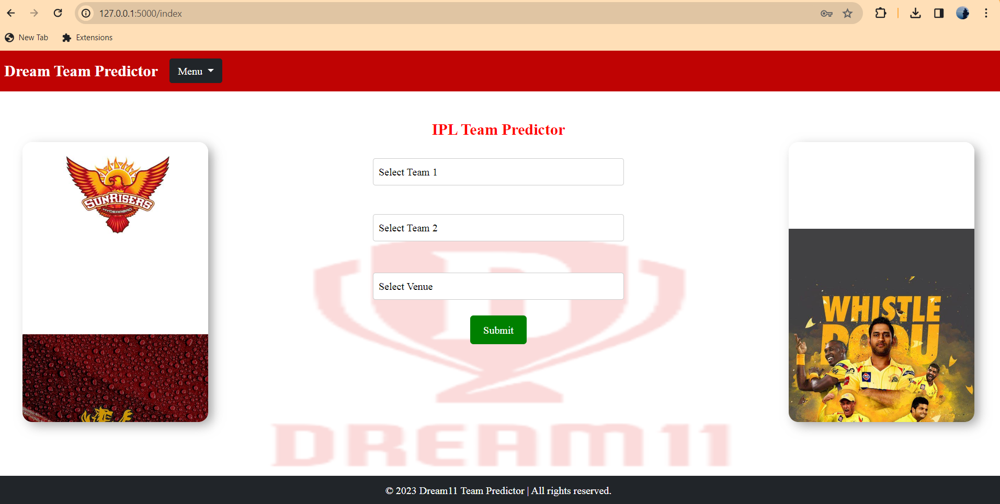
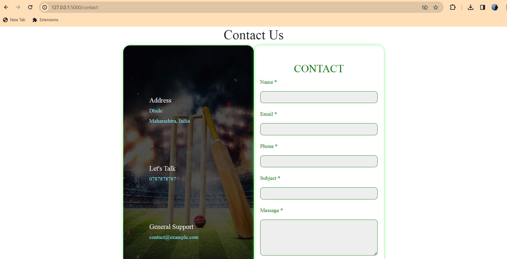
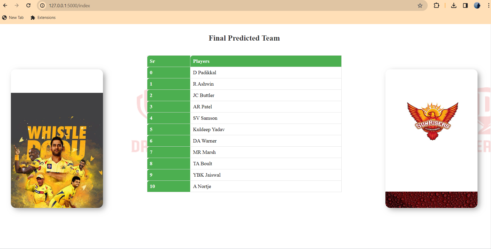

# Fantasy Cricket Team Predictor

## Overview
This web application predicts fantasy cricket teams based on player statistics. It takes input from the user, selects players for two teams, analyzes their performance, and predicts the best fantasy cricket team.

## Prerequisites
Make sure you have the following dependencies installed before running the application:
- Flask
- pandas
- numpy
- matplotlib
- seaborn 

You can install these dependencies using the following command:
```bash
pip install Flask pandas numpy matplotlib seaborn
```

## Getting Started
1. Clone the repository:
   ```bash
   git clone https://github.com/your-username/fantasy-cricket-predictor.git
   cd fantasy-cricket-predictor
   ```

2. Run the Flask application:
   ```bash
   python dream.py
   ```

3. Open your web browser and navigate to `http://127.0.0.1:5000/` to use the application.

## Usage
1. Select players for Team 1 and Team 2.
2. Submit the form to get the predicted fantasy cricket team.

## Project Structure
- `dream.py`: Flask application script.
- `Teams/`: Folder containing player information for each team.
- `static/`: Folder for static assets (CSS, images, etc.).
- `templates/`: Folder containing HTML templates.
- `videos/`: Folder for project videos and images.

## Screenshots
Here are some screenshots of the application:

- Login Page
  

- Home Page
  

- Contact Page
  

- Result Page
  

## Project Output Result Video
Watch the project output result by clicking below.

[![Click Here]](https://drive.google.com/file/d/1xdg22R2csdGbAvZakXovRlCtF4PIjtNg/view?usp=drivesdk)

## Contacts
For any inquiries, issues, or contributions, please contact:

- Kalparatna Mahajan
  - Email: kalparatna223@gmail.com
  - GitHub: [GitHub Profile](https://github.com/Kalparatna)

## Additional Notes
- Ensure you have the required libraries installed by running the provided `pip install` command.
- Customize the code as needed for your specific requirements.
- Modify the `README.md` file to provide more details about the project and usage instructions.
- This is a sample README file; make sure to update it based on your actual project details.

## License
This project is licensed under the [MIT License](LICENSE).

